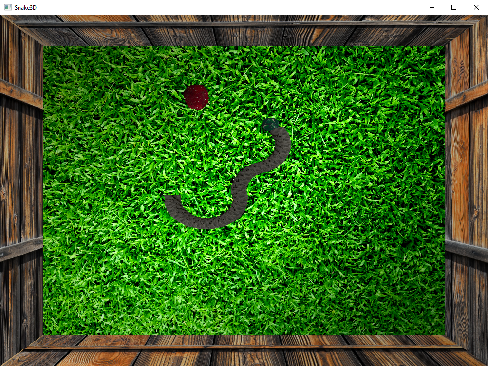

<h1 align="center">
    Snake 3D 🐍
</h1>

## About
<b>Snake 3D is implementation of popular 2D game snake.</b> Snake 3D was created for the purpose of Graphic and Visualisation Poznań University of Technology, learning basics of OpenGl. Free camera was implemented and you can moving around and changing view and position.

## Presentation

## Rules of the game

Snake is very basic game, you need to feed snake by catching apples and avoiding walls and its own segments. Be carefull the more apples you pick the longer the snake will be, the harder it takes to rotate it!

## Instruction
ESC - exit application
<h4>Snake</h4>
A - rotate left  
D - rotate right
<h4>Camera</h4>
&#8593; - moving forward  
&#8595; - moving backward  
&#8594; - moving right  
&#8592; - moving left

## Extras
- GLFW
- GLEW
- GLM
